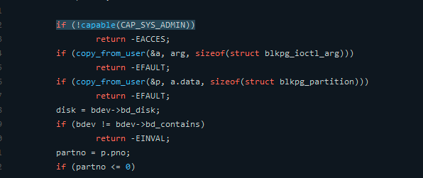

# Capabilties

Capabilities can be added via privilege escalation (e.g., sudo, file capabilities) or removed (e.g., setuid, or switching namespaces). Various capabilities control what the root user can do.

For example, the **CAP_SYS_BOOT** capability controls the ability of a given user to **reboot** the machine. 
There are also more common capabilities that are granted to users like **CAP_NET_RAW**, which allows a process the ability to open raw sockets. 
A user can automatically have capabilities added when they execute specific files via file capabilities. For example, on a stock Ubuntu system, the ping command needs CAP_NET_RAW:

    $ getcap $(which ping)

One of the most powerful capabilities in Linux is **CAP_SYS_ADMIN**, which is effectively equivalent to having **superuser access**. It gives the user the ability to do everything 
- mounting arbitrary filesystems, 
- accessing tracepoints that can expose vital information about the Linux kernel.
 
- **CAP_CHOWN** and **CAP_DAC_OVERRIDE** : which grant the capability to manipulate file permissions.
In the kernel, capability checks spread throughout the code, which looks something like this:

https://github.com/tinganho/linux-kernel/blob/master/block/ioctl.c

# References:
https://man7.org/linux/man-pages/man7/capabilities.7.html+